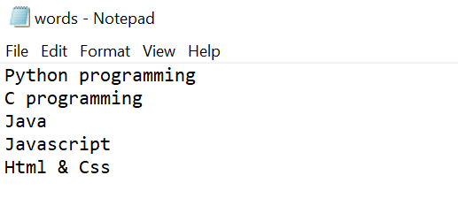

# Word-count
## AIM:
To write a python program for getting the word count from a text.
## EQUIPEMENT'S REQUIRED: 
PC
Anaconda - Python 3.7
## ALGORITHM: 
### Step 1:
Decleare number of words is 0
### Step 2: 
open it with words.txt file
### Step 3: 
Give range for i
### Step 4:  
Then nxt split the words
### Step 5: 
count the number of words
### Step 6: 
Giving print statement for getting output
## PROGRAM:
```
'''
To write a python program for getting the word count from a text.
Developed by: Ganesh.D
RegisterNumber:23013987
'''
num=0
with open("C:/Users/BSS/Documents/words.txt","r") as f1:
    for i in f1:
        word=i.split()
        num += len(word)
print("The number of words are in the file is ",num)
```
### OUTPUT:




## RESULT:
Thus the program is written to find the word count from a text.
Then, the program code is successfully executed.
